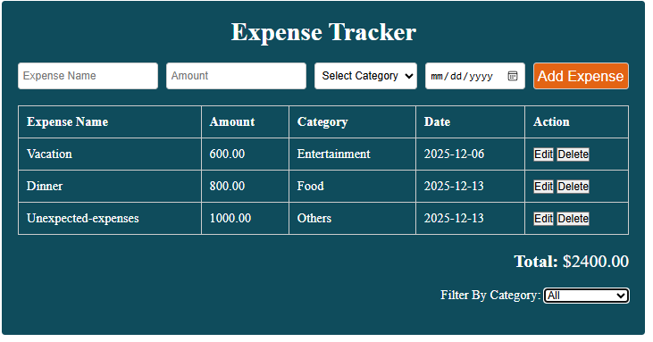

# This is a simple expense tracker app build using html, css and JavaScript
    # In this project I learned how to update the DOM.
    # I learned how to edit and delete items from the DOM.
    # I learned how to filter items based on certain category.
    # I learned how to use select to update the DOM based on 
    a type of selection.

    #I learned how to use reduce to calculate total expenses

    This was a great project overall and I learned a lot of things.

# For version 1.01 i added the locale storage functionalities so when the page reloaded the data does not get loss. And i also save the data in the local storage.

# In this version of the project the media queries have been added so the page can be responsive on mobile
Version 1.1
